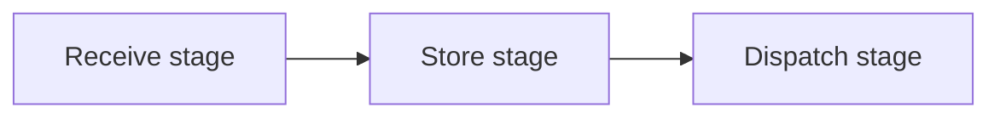

# Robot arm Warehouse
Robot arm represents arbitrary package manipulation device that can be configured to simulate different types of manufacturing and supply chain facilities. One of them is a warehouse facility. Warehouse is facility for storing packages. 

Storing of packages is divided into three stages receive stage, store stage and dispatch stage.

## Receive stage
At receive stage the packages are begin received at the loading dock and are moved to the intermediate buffer location

## Store stage
## Dispatch stage

### Properties
|name|type|description|units
|---|---|---|---|
|operationalArea|struct| operating area of the robot|
|operationalArea.width|number|width of the operating area|mm
|operationalArea.length|number|length of the operating area|mm
|operationalArea.widthOffset|number|offset width of the operating area|mm
|operationalArea.lengthOffset|number|offset length the operating area|mm
|docks|array(struct)| list of docking areas|
|dock| struct| docking area structure|
|dock.width| number|width of the docking area|mm
|dock.length| number|height of the docking area|mm
|dock.widthOffset|number|with offset center point of dock|mm
|dock.lengthOffset|number|length offset center point of dock|mm
|dock.maxPackage| number|maximum number of packages|count
|dock.type|[STORAGE, RAMP]|definition of dock type 
|dock.loadingHeight|loading height of transportational vehicle
|package|struct|properties of packages|
|package.width|number|width of the package|mm
|package.length|number|length of the package|mm
|package.height|number|height of the package|mm

### Variables
|name|type|description|units
|---|---|---|---|---|
|packages|struct|list of all packages present in warehouse|
|state|IDLE,MOVING,STORING,UNSTORING|

### Actions
|route|description|params|errors|unit
|---|---|---|---|---|
|get/parameters|get all parameters of the model|
|set/parameters|set whole parameters structure and initialize model||-can't initialize configuration|
|get/packages|get list of packages
|basic/moveTo|move robot to specific location|x,y,z|-can't move outside operating area, -can't move packages in way|mm,mm,mm|
|basic/stop|halt robot movment|
|basic/move|move robot from current position|dx,dy,dz|-can't move outside operating area, -can't move packages in way|mm,mm,mm
|advanced/store|unload from ramp dock and put to nearest empty storage dock|id_package, id_loading_dock|-can't store warehouse full|
|advanced/unstore|unload from storage dock and load to ramp dock|id_package,id_dock|
