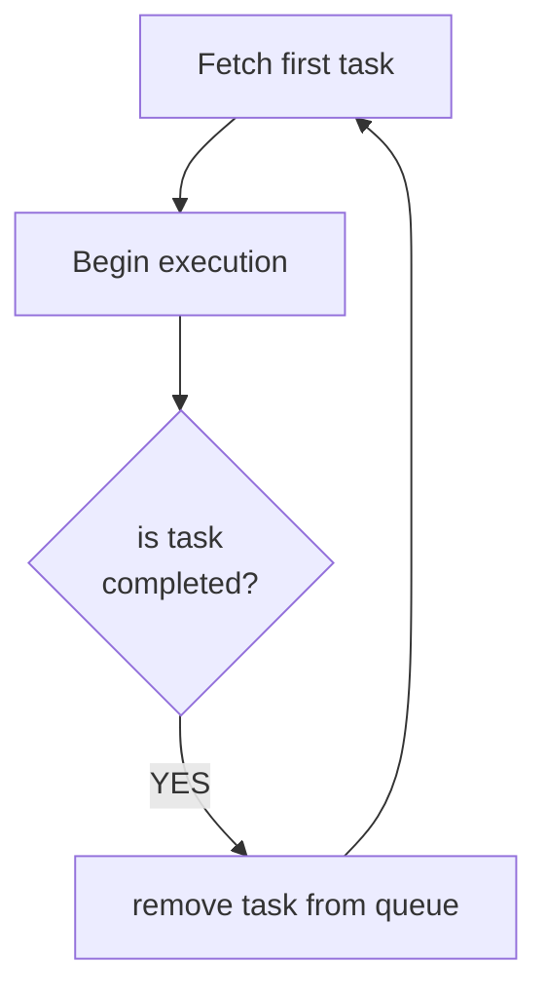

# Robot arm Warehouse

This README file provides documentation for the warehouse application utilized in the 2022/2023 Summer School on Industrial Internet of Things (IIoT) and Blockchain Technology. For information regarding the warehouse application used for the 2022 internship practical assignment involving two French students, please refer to the subfolder /FRA-internship-2022.

## Layout
The robot arm in this application serves as a versatile package manipulation device. It can be configured to simulate various types of manufacturing and supply chain facilities. One such configuration allows it to represent a warehouse facility responsible for the storage of packages. The layout of this simulated warehouse is illustrated in the following figure:

* **operational area**
Robot arm movement is limited by the operational area which is a rectangularly shaped surface. 
* **dock**
Dock represents a position inside the operational area that is reserved for a placement of packages. There are five types of docks: receive dock, receive buffer dock, dispatch dock, dispatch buffer dock and storage dock
	* **receive dock / dispatch dock**
This type of dock is reserved for transportation vehicles for loading or unloading of their cargo (packages) 
	* **receive buffer dock**
This type of dock is reserved as an intermediate buffer storage during the unloading of transportation vehicles
	* **dispatch buffer dock**
This type of dock is reserved as an intermediate buffer storage during loading to transportation vehicles
	* **storage dock** 
This type of dock is used for storing packages 

## Package management process

Packages are relocated within the facility by a warehouse package management process. This process operates through the execution of tasks, which are organized and managed in a task management queue.

### Task management queue

An example of a task management queue is presented in the table below:

| Order | Task                                                  |
|-------|-------------------------------------------------------|
| 1     | {"mode": "load", "offerId": 11, "packageId": "abc"}   |
| 2     | {"mode": "move", "offerId": 37, "packageId": "bbb"}   |
| ...   | ...                                                   | 
| n     | {"mode": "unload", "offerId": 54, "packageId": "klm"} |

The task management process ensures that tasks are executed in the correct sequence. The task execution process begins by selecting the first task from the queue and initiating its execution. It remains in a waiting state until this task is completed. Once a task is completed, it is removed from the queue, and the next task in line is then assigned for execution.

### Tasks
There are several types of tasks, each with its own specific functionality:
* **load**: Transfers a package from the receiving dock (robot car) to the receiving buffer.
* **unload**: Transfers a package from one of the storage docks to the dispatch dock (robot car) .
* **move**: Reallocates a package internally when the buffers or storage docks reach their maximum occupancy.

## Implementation

### Programming code organization

| file name      | description                                                                                                                                                                                                                                                                                                                                                                                                                                                                                                                                                                                                         | comments                                                                                                 |
|----------------|---------------------------------------------------------------------------------------------------------------------------------------------------------------------------------------------------------------------------------------------------------------------------------------------------------------------------------------------------------------------------------------------------------------------------------------------------------------------------------------------------------------------------------------------------------------------------------------------------------------------|----------------------------------------------------------------------------------------------------------|
| index.js       | app starting point, sets up a web server, maintains tasks queue, processes tasks                                                                                                                                                                                                                                                                                                                                                                                                                                                                                                                                    |                                                                                                          |
| warehouse.js   | Warehouse class constructor to initialize a new warehouse instance, functions to reset the warehouse to its initial state, to save the current state of the warehouse to a file, to print the current state of the warehouse to the console, and to read and restore the last saved state of the warehouse from a file                                                                                                                                                                                                                                                                                              |                                                                                                          |
| queue.js   | constructors for queues for all docks (4 storage docks, receiver and dispatch buffer)                                                                                                                                                                                                                                                                                                                                                                                                                                                                                                                               | **note**: receiveDock and dispatchDock sizes are set to 1 as the car only carries one package at a time  |
| motion.js | functions for robotic arm moves: *go()*: enables moves to be made in the horizontal plane at a default height *suctionON()*: moves the arm down to the tag detection height, detects the tag (center and ID), corrects the position to align with the tag's center, moves further down to the actual location of the package, activates the suction, and then moves back up *suctionOFF()*: moves down to the actual location of the package, deactivates the suction, and moves back up; if this move is directed towards the dispatch dock (robot car), the precise location is determined using April Tag detection in a manner similar to the suctionON() function.  | these functions are called asynchronously, but they are executed in a sequential order using async/await |
| warehouse.json | JavaScript object with the current state of the warehouse                                                                                                                                                                                                                                                                                                                                                                                                                                                                                                                                                           | the warehouse state is stored to this file after any function in motion.js finishes                      |
| config.json    | configuration data for the app                                                                                                                                                                                                                                                                                                                                                                                                                                                                                                                                                                                      |                                                                                                          |

### Warehouse properties

| name                | type                       | description                                                                       |
|---------------------|----------------------------|-----------------------------------------------------------------------------------|
| queueStorageDock1   | JavaScript object          | object contains information about the packages in the dock                        |
| queueStorageDock2   | =                          | =                                                                                 |
| queueStorageDock3   | =                          | =                                                                                 |
| queueStorageDock4   | =                          | =                                                                                 |
| queueReceiveBuffer  | =                          | =                                                                                 |
| queueDispatchBuffer | =                          | =                                                                                 |
| queueXXX.items      | array                      | an array of packageIds, from the bottom to the top of the dock                    |
| queueXXX.maxLength  | int                        | maximum number of packages in the dock as defined in configuration                |
| queueXXX.topIndex   | int                        | an index of the package currently at the top of the dock; -1 if the dock is empty |
| tasksQueue          | array of JSON objects task | a queue for task management process                                               |       |

### HTTP API
| name                        | parameters                                     | description                                       			               | returns                                |
|-----------------------------|------------------------------------------------|---------------------------------------------------------------------|----------------------------------------|
| <code>/requestsQueue</code> | /                              					           | get current state of the requests (tasks) queue 					               | tasksQueue in JSON string format 		    |
| <code>/warehouse</code>     | /                              					           | get current state of the warehouse (array of packages in all docks) | warehouse object in JSON string format |
| <code>/dispatch</code>      | {"packageId": id, "offerId": id, "mode": load} | called by a controll app to request a dispatch (load/unload)        | {status: accept/reject} 				           |

### State of the application after 2022 Summer School on IIoT and blockchain
* the application is currently operational with the following characteristics:
	* The terms "receiveDock" and "dispatchDocks" refer to the same entity -- the dock on the robot car. Both of these have been configured with a size of 1.
	* The sizes of receiveBuffer, dispatchBuffer, and storage docks are currently set to 2. However, the dispatchBuffer is not being utilized in the application at this time.
	* The receiveBuffer begins relocating packages when its occupation limit of 2 is reached. Relocations from the receiveBuffer or any of the storage docks are directed towards the least occupied location.
	* Unloading tasks are performed directly to the dispatch dock (robot car), bypassing the dispatch buffer entirely.
	* Move speeds for the /move command are set in the configuration, while move durations for the /moveTo command are calculated adaptively, based on the starting and finishing locations.
	* To avoid overly rapid or slow movements, the setTimeout durations for the robotic arm commands are determined by the starting and finishing locations.
	* At this time, the robotic arm does not employ camera recognition to identify packages using AprilTags and accurately position above the center of the package. This feature is planned for future implementation in a separate project, found at: https://github.com/fsprojekti/shr-mfg-robotic-arm-visual-detection
	* Most of the application parameters are derived from the config.json file.

### TODO list for the robotic arms for 2023 Summer School on IIoT and blockchain
* implement visual detection and correction of the packages using AprilTags: integrate solution from Wei Wang: https://github.com/fsprojekti/shr-mfg-robotic-arm-visual
* reconfigure internal package movements/relocations:
	* use dispatchBuffer?
	* how big should the receiveBuffer and dispatchBuffer be?
	* where to put the the package: to the least occupied dock or should a more advanced logic be used?
	* how to relocate packages that are above the currently processed package? what kind of logic should be used?

### State of the robotic arms after 2022 Summer School on IIoT and blockchain
* operating system is burned to an SD card
* only use OS image received by the robotic arm manufacturer which is adapted to the specific version of the robotic arm
* by default, after the OS boots the HiWonder toolbox process sets up a WiFi hotspot to enable connections from other computers
	* to connect the robotic arm to other WiFi networks, change the following file:
		* filename: /home/hiwonder/hiwonder_wifi_conf.py
		* uncomment the line: **HW_WIFI_MODE** and set it to **2**
		* uncomment the lines **HW_WIFI_STA_SSID** and **HW_WIFI_STA_PASWWORD** and set the WiFi network SSID and password
* all robotic arms' servos have been checked and replaced if malfunctioning
* tested and working robotic arms: 13001, 13002, 13003 **CHECK**
* robotic arms currenlty not working: 13004, 13005 --> check WiFi connectivity and/or OS installation
