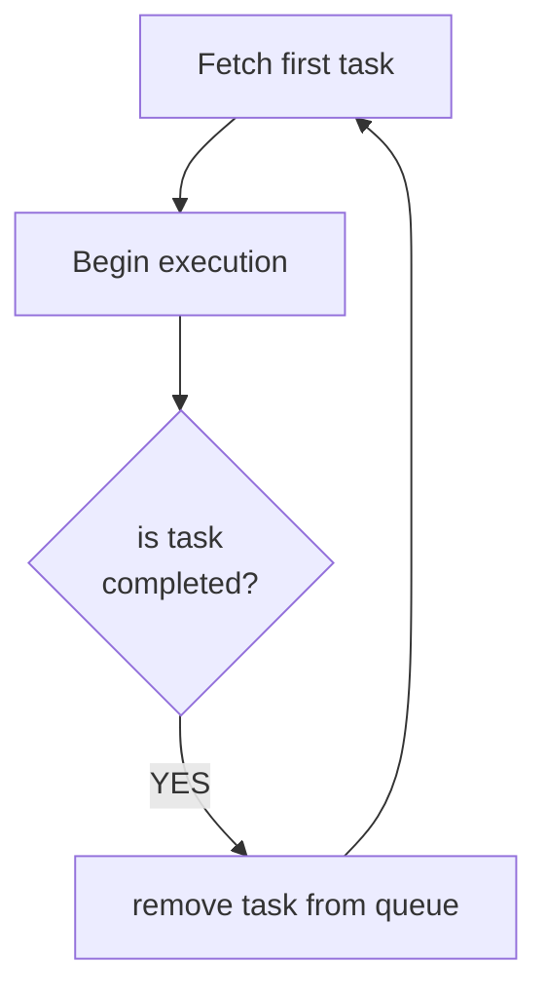

# Robot arm Warehouse

## Layout
Robot arm represents an arbitrary package manipulation device that can be configured to simulate different types of manufacturing and supply chain facilities. One of them is a warehouse facility that stores packages. The layout of the warehouse is presented in the figure:

* **operational area**
Robot arm movement is limited by the operational area which is a rectangularly shaped surface. 
* **dock**
Dock represents a position inside the operational area that is reserved for a placement of packages. There are five types of docks: receive dock, receive buffer dock, dispatch dock, dispatch buffer dock and storage dock
	* **receive dock**
This type of dock is reserved for transportation vehicles for unloading of their cargo (packages) 
	* **receive buffer dock**
This type of dock is reserved as an intermediate buffer storage during the unloading of transportation vehicles
	* **dispatch dock**
This type of dock is reserved for transportation vehicles for loading cargo 
	* **dispatch buffer dock**
This type of dock is reserved as an intermediate buffer storage during loading to transportation vehicles
	* **storage dock** 
This type of dock is used for storing packages 

## Package management process

Packages are moved by warehouse package management process via execution of tasks that are collected in the package management queue. 

### Package management queue

Example of package management queue is shown in the table:

Order|Task|
|---|---|
|1|task 1|
|2|task 2|
|...|...| 
|n|task n|

Package management process ensures tasks are executed in the right order. Task execution process takes first task from the queue and starts the process of task execution. It waits for the task completion. After task completion, the task is removed from the queue and the next task in line is assigned for execution.

### Tasks
There are several types of tasks with specific functionalities.

### Receive task

Package is being received at a *receive dock* (this is where transport stops to unload) and is moved to a *receive buffer dock*. Task parameters are described in the table:
|Name|Description|
|---|---|
|package|id of a package to be received by the warehouse|
|receive dock|id of the dock where the transportation vehicle will wait for unloading of a package|
|receive buffer dock|id of the dock where robotic arm will move a package when it is unloaded from the transportation vehicle

Process behind receiving a task is described with the flowchart:

### Store task
Store task moves a package from a receive buffer dock to specific storing dock. Finding optimal storage dock is calculated by a stacking algorithm. Task parameters are described in the table:

|Name|Description|
|---|---|
|package|id of a package to be moved to storage dock|
|receive buffer dock|id of the dock where a package waits to be stored|
|stack type|type of a stacking algorithm to calculate optimal storage dock

Store task process is described with flowchart:

#### Stacking algorithm
Stacking algorithm calculates the optimal dock where the package will be stored. Optimal solution is based on certain criteria, it can be as simple as finding the first empty dock or it can be more complex like minimizing storage time. 
Types of stacking algorithms are collected in the table:
|Type| Description|
|---|---|
|FIRST|Find the first empty dock| 

### Swap task
Swap task moves a package from source storage dock to target storing dock. This task is used to swap packages in order to optimize warehouse package management.  Task parameters are described in the table:

|Name|Description|
|---|---|
|package|id of a package to be moved to target storage dock|
|source storage dock|id of the dock where a package waits to be stored|
|stack type|type of a stacking algorithm to calculate optimal storage dock

Store task process is described with the flowchart:

### Unstore task

### Dispatch task

## Implementation

### Properties

|name|type|description|units
|---|---|---|---|
|operationalArea|struct| operating area of the robot|
|operationalArea.width|number|width of the operating area|mm
|operationalArea.length|number|length of the operating area|mm
|operationalArea.widthOffset|number|offset width of the operating area|mm
|operationalArea.lengthOffset|number|offset length the operating area|mm
|docks|array(dock)| list of docking areas|
|dock| struct| docking area structure|
|dock.id|id|id of a dock|
|dock.width| number|width of the docking area|mm
|dock.length| number|height of the docking area|mm
|dock.widthOffset|number|with offset center point of dock|mm
|dock.lengthOffset|number|length offset center point of dock|mm
|dock.maxPackage| number|maximum number of packages|count
|dock.type|RECEIVE, RECEIVE_BUFFER, STORE, DISPATCH_BUFFER, DISPATCH|definition of dock type 
|dock.loadingHeight |loading height of transportation vehicle
|package|struct|package physical properties structure|
|package.radio |number|radio of the package|mm
|package.height|number|height of the package|mm

### Variables
|name|type|description|units
|---|---|---|---|
|slots|array(slot)|array of all slots in a warehouse|
|slot|structure of slot|
|slot.dock|id|id of dock to which slot belongs|
|slot.level|number|level of a slot (at which height the slot lies)
|slot.package|id|package id if slot is occupied else empty
|state|IDLE,MOVING,STORING,UNSTORING|Current state of warehouse
|queue|array(tasks)|queue for package management process|

