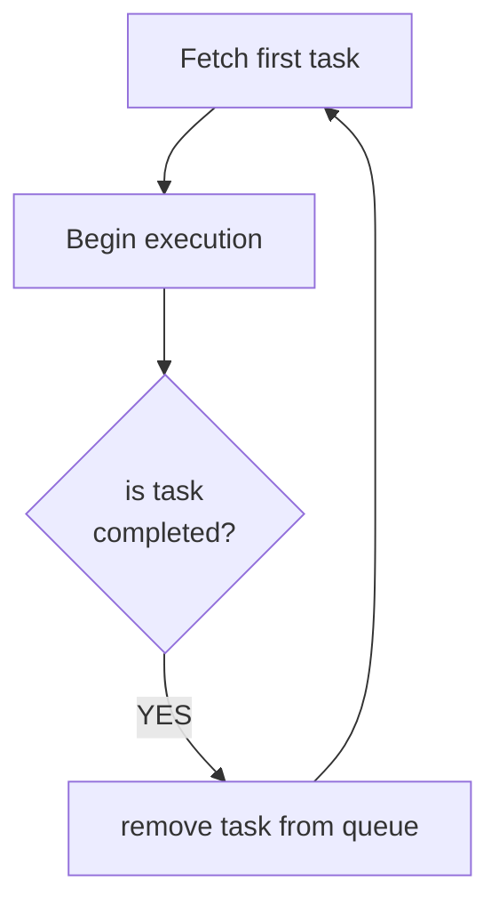

# Robot arm Warehouse

This README file is meant for the warehouse app used in 2022 Summer School on IIoT and blockchain technology. For the warehouse app used for 2022 internship practical assignment for two French students see subfolder /FRA-internship-2022.

## Layout
Robot arm represents an arbitrary package manipulation device that can be configured to simulate different types of manufacturing and supply chain facilities. One of them is a warehouse facility that stores packages. The layout of the warehouse is presented in the figure:

* **operational area**
Robot arm movement is limited by the operational area which is a rectangularly shaped surface. 
* **dock**
Dock represents a position inside the operational area that is reserved for a placement of packages. There are five types of docks: receive dock, receive buffer dock, dispatch dock, dispatch buffer dock and storage dock
	* **receive dock / dispatch dock**
This type of dock is reserved for transportation vehicles for loading or unloading of their cargo (packages) 
	* **receive buffer dock**
This type of dock is reserved as an intermediate buffer storage during the unloading of transportation vehicles
	* **dispatch buffer dock**
This type of dock is reserved as an intermediate buffer storage during loading to transportation vehicles
	* **storage dock** 
This type of dock is used for storing packages 

## Package management process

Packages are moved by warehouse package management process via execution of tasks that are collected in the tasks management queue. 

### Task management queue

Example of a task management queue is shown in the table:

| Order | Task   |
|-------|--------|
| 1     | task 1 |
| 2     | task 2 |
| ...   | ...    | 
| n     | task n |

Task management process ensures tasks are executed in the right order. Task execution process takes first task from the queue and starts the process of task execution. It waits for the task completion. After task completion, the task is removed from the queue and the next task in line is assigned for execution.

### Tasks
There are several types of tasks with specific functionalities:
* **load**: move a package from the receive dock (robot car) to the receive buffer
* **unload**: move a package from one of the storage docks to the dispatch dock (robot car) 
* **move**: interval move of the package if the buffers and storage docks reach its limit size

## Implementation

### Program organization

| file name      | description                                                                                                                                                                                                                                                                                                                                                                                                                                                                                                                                                                                                                                                                                                                                                                                                           | comments                                                                                 |
|----------------|-----------------------------------------------------------------------------------------------------------------------------------------------------------------------------------------------------------------------------------------------------------------------------------------------------------------------------------------------------------------------------------------------------------------------------------------------------------------------------------------------------------------------------------------------------------------------------------------------------------------------------------------------------------------------------------------------------------------------------------------------------------------------------------------------------------------------|------------------------------------------------------------------------------------------|
| index.js       | app starting point, sets up a web server, maintains tasks queue, processes tasks                                                                                                                                                                                                                                                                                                                                                                                                                                                                                                                                                                                                                                                                                                                                      | object containing data on packages in the dock                                           |
| warehouse.js   | Warehouse class constructor, functions to reset a warehouse, to save a warehouse state to a file, to print the warehouse state to the console and to read the last saved state of the warehouse                                                                                                                                                                                                                                                                                                                                                                                                                                                                                                                                                                                                                       |                                                                                          |
| queuelifo.js   | constructors for queues for all docks (4 storage docks, receiver and dispatch buffer); **note**: receiveDock and dispatchDock sizes are set to 1 as the car only carries one package at a time                                                                                                                                                                                                                                                                                                                                                                                                                                                                                                                                                                                                                        |
| robotmotion.js | functions for robotic arm moves: *goReset()*: move above the reset location *goStorageD1()*: move above the storage dock 1 location *goStorageD2()*: move above the storage dock 2 location *goStorageD3()*: move above the storage dock 3 location *goStorageD4()*: move above the storage dock 4 location *goReceiveBuffer()*: move above the receive buffer location *goDispatchBuffer()*: move above the dispatch buffer location  *goReceiveDock()*: move above the receive dock location *goDispatchDock()*: move above the dispatch dock location *suctionON()*: move down to the actual location of the package, turn the suction on and move back up *suctionOFF()*: move down to the actual location of the package, turn the suction off and move back up  |                                                                                          |
| warehouse.json | JavaScript object with the current state of the warehouse                                                                                                                                                                                                                                                                                                                                                                                                                                                                                                                                                                                                                                                                                                                                                             | the warehouse state is stored to this file after any function in robotmotion.js finishes |
| config.json    | configuration data for the app                                                                                                                                                                                                                                                                                                                                                                                                                                                                                                                                                                                                                                                                                                                                                                                        |                                                                                          |

### Properties

| name                | type              | description                                                                |
|---------------------|-------------------|----------------------------------------------------------------------------|
| queueStorageDock1   | JavaScript object | object containing data on packages in the dock                             |
| queueStorageDock2   | =                 | =                                                                          |
| queueStorageDock3   | =                 | =                                                                          |
| queueStorageDock4   | =                 | =                                                                          |
| queueReceiveBuffer  | =                 | =                                                                          |
| queueDispatchBuffer | =                 | =                                                                          |
| queueXXX.items      | array             | array of packageIds, from the bottom to the top of the dock                |
| queueXXX.maxLength  | int               | maximum number of packages in the dock, defined in configuration           |
| queueXXX.topIndex   | int               | index of the package currently at the top of the dock; -1 if dock is empty |

### Variables
| name         | type                          | description                                     | units |
|--------------|-------------------------------|-------------------------------------------------|-------|
| slots        | array(slot)                   | array of all slots in a warehouse               |       |
| slot         | structure of slot             |                                                 |       |
| slot.dock    | id                            | id of dock to which slot belongs                |       |
| slot.level   | number                        | level of a slot (at which height the slot lies) |       |
| slot.package | id                            | package id if slot is occupied else empty       |       |
| state        | IDLE,MOVING,STORING,UNSTORING | Current state of warehouse                      |       |
| tasksQueue   | array(tasks)                  | queue for package management process            |       |

### HTTP API
| name                        | parameters                                     | description                                       			               | returns                                |
|-----------------------------|------------------------------------------------|---------------------------------------------------------------------|----------------------------------------|
| <code>/requestsQueue</code> | /                              					           | get current state of the requests (tasks) queue 					               | tasksQueue in JSON string format 		    |
| <code>/warehouse</code>     | /                              					           | get current state of the warehouse (array of packages in all docks) | warehouse object in JSON string format |
| <code>/dispatch</code>      | {"packageId": id, "offerId": id, "mode": load} | called by a controll app to request a dispatch (load/unload)        | {status: accept/reject} 				           |

